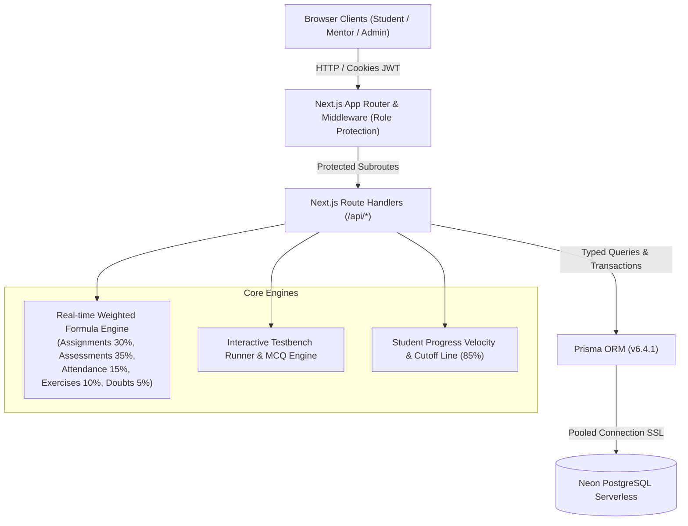

# ⚡ Skill Up — C++ Systems Engineering Platform by Super 60

> **A high-concurrency, enterprise-grade educational ecosystem and candidate evaluation engine designed to identify and mentor the Top 60 engineering candidates in systems programming, low-latency C++, and distributed computing.**

[](https://nextjs.org/)
[](https://react.dev/)
[](https://www.typescriptlang.org/)
[](https://www.prisma.io/)
[](https://neon.tech/)
[](https://vitest.dev/)

---

## 🌟 Architecture Overview



---

## 🚀 Key Modules & Capabilities

### 1. Public Experience & Interactive Canvas
- **Dynamic Square Tile Matrix:** 60-cell interactive grid with hover states and glow response (`#070B14`, `#0B1120`, `#F07C27`).
- **Interactive Three.js 3D Core:** High-performance procedural wireframe torus knot rendered with `@react-three/fiber` and `@react-three/drei`.
- **Public Curriculum & About Platform:** Multi-track C++ roadmap, systems architecture syllabus, and cohort history.

### 2. Student Learning & Testbench Portal
- **Progress Velocity & Trend Visualization:** SVG weekly score curve mapped against the Super 60 induction cutoff benchmark line (85%).
- **In-Browser Exercise Testbench Simulator:** Client-side testbench assertion engine that validates code structure, entry points, and sample inputs/outputs with execution timing and memory metrics.
- **IDE Submission Studio:** Code submission interface with syntax styling, line counters, and submission state tracking.
- **Interactive Doubt Resolution:** Real-time thread messaging between enrolled students and lab mentors.

### 3. Mentor Mentorship & Grading Studio
- **Lab Roster & Student Performance Matrix:** Per-student drilldown with weighted scoring, attendance percentages, and doubt activity.
- **Batch Grading Queue:** Review submissions with score overrides, constructive feedback, and grading status updates.
- **Session Attendance Marking:** Session scheduling with one-click `PRESENT`, `ABSENT`, or `LATE` student roll calls.
- **Question Bank & Test Management:** Author MCQs, multiple-choice questions, code problems, and configure test timers.

### 4. Admin Executive Headquarters & Evaluation Pipeline
- **Super 60 Candidate Selection Pipeline:** Ranked candidate intake pipeline with real-time score computations, quota tracker (`N / 60 Qualified`), and selection decisions (`SELECTED`, `PENDING`, `REJECTED`).
- **Advanced Performance Reports & CSV Export:** Multi-filter query engine (by Workshop, Lab, Score Cutoff, Candidate Name) with 1-click CSV export for offline analysis.
- **Configurable Formula Weights:** Workshop-level evaluation weight customization with sum validation.
- **Multi-Year Workshop Isolation:** Switch between workshops (e.g. 2026, 2027) with data isolation.
- **System Audit Log:** Comprehensive tracking of administrative actions and grade modifications.

---

## 🗄️ Database Architecture

The data layer is managed with **Prisma ORM** connected to a serverless Neon PostgreSQL cluster across 23 relational models:

| Model | Purpose |
|---|---|
| `User` | Student, Mentor, and Admin authentication and core profile details |
| `Workshop` | Annual cohort scoping (e.g., Skill Up 2026, 2027) with custom weight configs |
| `WorkshopEnrollment`| Student cohort enrollment status (`PENDING`, `ENROLLED`, `SELECTED`, `REJECTED`) |
| `Lab` | Workshop sub-laboratories (1 mentor per lab, 15–30 students) |
| `LabMentor` & `LabStudent` | Relational join tables for laboratory allocations |
| `Assignment` & `Submission` | Mentor-issued challenges, code solutions, grading scores, and mentor feedback |
| `Exercise` & `ExerciseSubmission` | Daily coding challenges, problem statements, sample I/O, and testbench status |
| `Assessment` & `Question` | Formal examinations, MCQs, code questions, duration limits, and point values |
| `AssessmentResult` & `Answer` | Student test results, score records, and answer logs |
| `Session` & `AttendanceRecord` | Workshop lectures, roll calls, and attendance logs |
| `Doubt` & `DoubtMessage` | Mentorship discussion threads and resolution status |
| `Note` | Lecture slides, kernel guides, PDFs, and repository links |
| `Announcement` | Workshop-wide broadcasts with in-app notification triggers |
| `Notification` | Per-user alert bell notifications |
| `Feedback` | Anonymous student reviews for mentors and laboratories |
| `AuditLog` | Security and administrative audit trail |

---

## 🔑 Demo Access Credentials

The database comes pre-seeded with sample role accounts for testing and evaluation:

| Role | Email | Password | Access Level |
|---|---|---|---|
| **Admin** | `admin@super60.edu` | `Admin@123` | Full administrative headquarters, selection pipeline, user management |
| **Mentor** | `mentor@super60.edu` | `Mentor@123` | Assigned lab roster, grading queue, attendance roll call, test authoring |
| **Student** | `student@super60.edu` | `Student@123` | Student learning dashboard, testbench simulator, progress trend, doubts |

---

## ⚙️ Installation & Development Workflow

### Prerequisites
- Node.js 18.x or 20.x
- npm 9.x or later
- Neon PostgreSQL connection string (configured in `.env`)

### 1. Clone & Install Dependencies
```bash
git clone https://github.com/darkuser1446/skilluo.git
cd skillup
npm install
```

### 2. Environment Configuration
Create a `.env` file in the root directory:
```env
DATABASE_URL="postgresql://<user>:<password>@<neon-host>/skillup?sslmode=require"
JWT_SECRET="super60_skillup_secret_key_jwt_2026_systems_platform_token"
NEXT_PUBLIC_APP_URL="http://localhost:3000"
```

### 3. Database Schema Push & Client Generation
```bash
npx prisma db push
npx prisma generate
```

### 4. Execute Unit & Performance Test Suite
```bash
npm test
```

### 5. Launch Development Server
```bash
npm run dev
```
Open [http://localhost:3000](http://localhost:3000) in your browser.

---

## 🧪 Testing Architecture

Skill Up utilizes **Vitest** for fast unit and service verification:
- `tests/auth.test.ts`: Verifies JWT cryptographic signing, token validation, role claims, and expiration bounds.
- `tests/performance.test.ts`: Validates the weighted composite formula math across standard and customized weight configurations, cutoff threshold logic, and doubt clamping.
- `tests/api-response.test.ts`: Enforces standard response envelopes (`successResponse`, `errorResponse`, pagination metadata).

To execute tests:
```bash
npm test
```

---

## 🛡️ License

Developed for the **Super 60** engineering initiative. All rights reserved.
